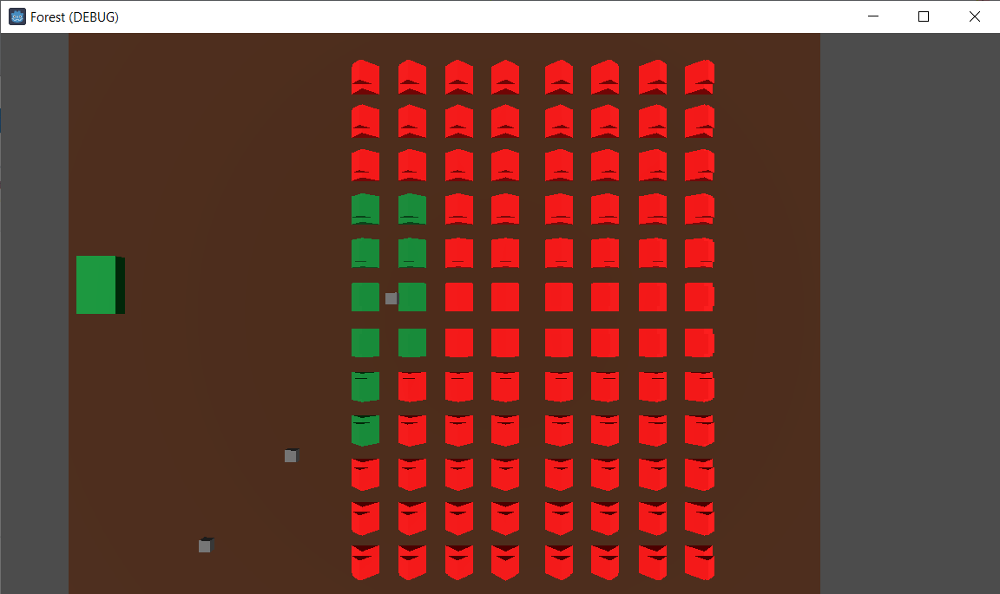

Robot Swarms for Precision Agriculture
------------------------------------------

# Overview

This project focuses on developing a simulation of robot swarms, specifically drones, for precision agriculture. The primary objective is to create a system where these drones work together to efficiently and autonomously water, fertilize, and manage infected plants by administering pesticide. This approach offers several benefits, including increased crop yields, reduced resource wastage, and improved plant health.

# Introduction
Agriculture is a vital industry, and the efficient use of resources is essential for its sustainability. Robot swarms provide a promising solution to optimize various farming tasks. In this project, we focus on simulating drone swarms that can work together to manage crops effectively.

# Features
+ Distributed Coordination: Drones communicate and coordinate their actions to maximize efficiency and minimize overlap.
+ Plant Health Monitoring: Drones use sensors and image recognition to identify plant health issues.
+ Precision Actions: Drones can administer precise amounts of water, fertilizer, and pesticide to individual plants.
+ Scalability: The simulation can scale to accommodate larger or smaller fields.

# Contributing
We welcome contributions from the open-source community. Feel free to submit bug reports, feature requests, or even pull requests to improve this project. 

# License
This project is licensed under the MIT License. See the [LICENSE](https://github.com/Momellouky/Robot-Swarms/blob/main/LICENSE) file for details.

For any questions or feedback, please contact us at contact.mellouky@gmail.com.